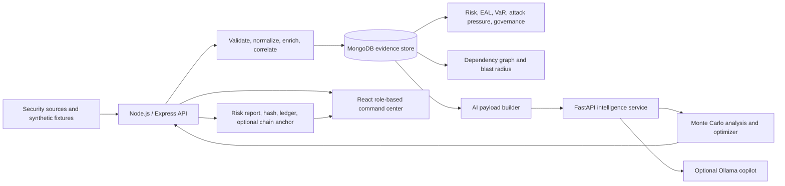

# Attack On Point

## CYBERSI — Evidence-Driven Cyber Risk Intelligence

CYBERSI is an evidence-driven cyber risk intelligence platform that brings security telemetry, vulnerability findings, business context, financial exposure, control effectiveness, and governance evidence together in a role-based command center.

The platform helps security teams and business leaders move beyond raw scanner output toward explainable risk decisions:

- What is exposed?
- How significant is the exposure?
- What could it cost?
- Which controls are worth funding?
- Can the resulting decision and report be independently verified?

> **Project status:** Synthetic-data demonstration and research platform. Financial, compliance, and risk outputs must be calibrated and validated before being used for real-world decisions.

## Highlights

- Multi-source ingestion for Wazuh, Burp Suite, OpenVAS, Nmap, EDR, IAM, CSPM, and threat-intelligence telemetry.
- Canonical evidence models for assets, vulnerabilities, security events, controls, incidents, and ingestion jobs.
- Risk quantification using CVSS, EPSS, CISA KEV status, patch age, internet exposure, business criticality, and bounded observed attack pressure.
- Financial risk metrics including Expected Annual Loss (EAL), Value at Risk (VaR), and impact breakdowns for breach, downtime, regulatory, and reputation exposure.
- Dependency-aware asset analysis with a bounded blast-radius score that preserves the certified base risk score.
- What-if control simulations with overlap-aware reduction and remediation-delay modelling.
- Budget-constrained control optimization with a labelled severity-only comparison baseline.
- Control effectiveness based on claimed effectiveness, configuration coverage, compliance coverage, and incident history.
- Regulatory framework coverage derived from stored control status and framework mappings.
- Role-based workspaces for executive, technical, analyst, and viewer audiences.
- Evidence-grounded analyst copilot with optional Ollama responses and an explicitly labelled deterministic fallback.
- Hash-linked audit records, optional blockchain-compatible anchoring, report verification, and safe tamper testing.

## Architecture



For the detailed architecture and endpoint map, see [`ATTACK_ON_POINT_ARCHITECTURE.md`](ATTACK_ON_POINT_ARCHITECTURE.md).

## Core Workflow

```text
Ingest → Normalize → Enrich → Correlate → Quantify → Explain → Decide → Verify
```

1. Security tools and telemetry sources submit findings or events.
2. The backend validates, normalizes, enriches, and stores evidence with provenance.
3. Risk services calculate asset scores, EAL, VaR, risk drivers, attack pressure, governance coverage, and dependency impact.
4. The AI service performs Monte Carlo analysis, portfolio optimization, and analyst queries.
5. The frontend presents role-specific decisions through dashboards, the Investment Lab, the Asset Risk register, and Audit Evidence.
6. Reports can be hashed, chained, optionally anchored, and verified through the audit surface.

## Product Areas

### Executive Workspace

Portfolio EAL, VaR, security budget, priority findings, asset concentration, framework posture, and board-ready risk context.

### Technical Workspace

Active attack signals, KEV findings, patch age, asset ranking, telemetry activity, and event investigation.

### Asset Risk

Business context, criticality, internet exposure, financial impact, risk drivers, dependencies, and the additive blast-radius view.

### Findings and Evidence Pipeline

Unified vulnerability records, enrichment status, ingestion jobs, attack-pressure hotspots, regulatory coverage, and scenario history.

### Investment Lab

What-if modelling, budget constraints, control effectiveness, investment curves, ROSI indicators, optimizer recommendations, and severity-only comparison.

### Analyst Copilot

Evidence-grounded questions for business and technical users. Ollama is optional; deterministic fallback responses remain explicitly labelled.

### Audit Evidence

Risk report verification, append-only ledger inspection, blockchain status, report hashes, transaction references, and safe tamper testing.

## Repository Structure

```text
.
├── attack_on_point_backend_hardened/
│   ├── src/
│   │   ├── controllers/       # Request handling and API orchestration
│   │   ├── middleware/        # Authentication and authorization
│   │   ├── models/            # MongoDB schemas
│   │   ├── routes/            # HTTP API surface
│   │   ├── services/          # Risk, ingestion, analytics, audit, and AI bridge
│   │   └── normalizers/       # Canonical evidence contracts
│   ├── seed.js                # Synthetic dataset seeding
│   ├── seed-users.js          # Local demo users
│   └── synthetic_enterprise_telemetry.json
├── attack_on_point_ai_fastapi_hardened/
│   ├── app/math_engine.py     # Monte Carlo risk analysis
│   ├── app/optimizer.py       # Budget-constrained optimization
│   ├── app/llm.py             # Ollama and fallback copilot behavior
│   └── tests/                 # Python regression tests
├── attack_on_point_frontend_redesigned/
│   └── src/                   # React/Vite command center
├── ATTACK_ON_POINT_ARCHITECTURE.md
├── LOCAL_RUN_GUIDE.md
└── MANUAL_REVERIFICATION_CHECKLIST.md
```

## Local Demo Mode

The frontend includes a local demo mode that runs without MongoDB or FastAPI. It is suitable for UI review and stakeholder walkthroughs.

```bash
cd attack_on_point_frontend_redesigned
npm install
npm run dev -- --host 0.0.0.0
```

Open <http://localhost:5173> and use the demo accounts documented in [`LOCAL_RUN_GUIDE.md`](LOCAL_RUN_GUIDE.md).

Demo accounts are local-only fixtures and must not be reused outside a local demonstration environment.

## Full Local Setup

### Prerequisites

- Node.js 20 or newer
- Python 3.11 or newer
- MongoDB
- Postman for telemetry testing
- Ollama, optional, for live language-model answers

### 1. Start the backend

```bash
cd attack_on_point_backend_hardened
npm install
cp .env.example .env
```

Set fresh local values for `MONGO_URI`, `API_KEY`, `JWT_SECRET`, and the AI service URLs. Never reuse production credentials or commit a populated `.env` file.

```bash
npm run seed:replace
npm run seed:users
npm run check:syntax
npm start
```

The backend listens on `http://localhost:4000` by default.

### 2. Start the AI service

```bash
cd attack_on_point_ai_fastapi_hardened
python -m venv .venv
source .venv/bin/activate
pip install -r requirements.txt
cp .env.example .env
python run.py
```

On Windows PowerShell:

```powershell
.venv\Scripts\Activate.ps1
```

The AI service listens on `http://localhost:8000` by default. Set `AI_API_KEY` to the same value as the backend `API_KEY`.

### 3. Start the frontend

```bash
cd attack_on_point_frontend_redesigned
npm install
cp .env.example .env
```

Set the frontend API endpoint:

```env
VITE_API_BASE_URL=http://localhost:4000
```

Start the development server:

```bash
npm run dev -- --host 0.0.0.0
```

## API Surface

### Ingestion

| Method | Endpoint |
| --- | --- |
| `POST` | `/telemetry/wazuh` |
| `POST` | `/telemetry/burp` |
| `POST` | `/telemetry/openvas` |
| `POST` | `/telemetry/nmap` |
| `POST` | `/telemetry/edr` |
| `POST` | `/telemetry/iam` |
| `POST` | `/telemetry/cspm` |
| `POST` | `/telemetry/threat-intel` |
| `POST` | `/vulnerabilities` |
| `GET` | `/ingestion/jobs` |

Machine ingestion requests require the backend `x-api-key` header.

### Risk and Decision Intelligence

- `GET /analytics/attack-pressure`
- `GET /analytics/dependencies/:asset_id`
- `GET /analytics/regulatory-coverage`
- `GET /analytics/risk-trend`
- `GET /analytics/risk-forecast`
- `POST /analytics/what-if`
- `POST /analytics/optimize`
- `POST /analytics/optimizer-comparison`
- `GET /analytics/investment-curve`
- `GET /assets/:asset_id/blast-radius`

### Audit and AI

- `GET /analytics/audit-report`
- `POST /ai/run-analysis`
- `GET /ai/payload`
- `POST /ai/results`
- `GET /ai/audit-ledger`
- `GET /ai/verify-data`
- `POST /ai/verify-data/tamper-test`
- `POST /analyst/query`

## Security and Governance

- JWT-based authentication and role authorization.
- API-key protection for machine telemetry ingestion and backend-to-AI calls.
- Configurable CORS, Helmet security headers, request IDs, and body-size limits.
- Evidence provenance through source identifiers, timestamps, raw hashes, and ingestion-job links.
- Chained risk audit records with optional blockchain-compatible anchoring.
- Sensitive configuration excluded through environment files and repository ignore rules.

## Validation

### Backend

```bash
cd attack_on_point_backend_hardened
npm run check:syntax
npm run test:blast-radius
```

### AI service

```bash
cd attack_on_point_ai_fastapi_hardened
python -m unittest discover -s tests -v
python -m py_compile app/*.py run.py tests/*.py
```

The project validation also covers browser verification of the executive dashboard, what-if flow, audit verification and tamper testing, analyst copilot, live attack feed, and blast-radius behavior.

## Design Boundaries

- Attack pressure is an evidence-based telemetry signal, not a threat-intelligence prediction.
- Regulatory coverage is an evidence-derived dashboard metric, not legal, regulatory, or audit certification.
- Blast radius is an estimated propagation metric; it does not alter the certified base risk score.
- The optimizer is optional and includes a labelled severity-only comparison fallback.
- MongoDB ingestion is synchronous in this release. Distributed queues such as Redis or Kafka are deferred until measured throughput requires them.
- Correlated-risk Monte Carlo portfolio simulation is outside the current implementation scope.
- Synthetic control costs and governance statuses must be calibrated before using financial or compliance outputs for real decisions.

## Contributing

Contributions, issue reports, and improvement proposals are welcome. Before submitting changes:

1. Review the architecture and local run guide.
2. Keep secrets, tokens, private keys, `.env` files, and downloaded model files out of commits.
3. Run the relevant backend, AI, and frontend validation commands.
4. Document changes to API contracts, risk calculations, or evidence models.

## License

No license has been specified for this repository yet. Add an appropriate license before public distribution or reuse.
